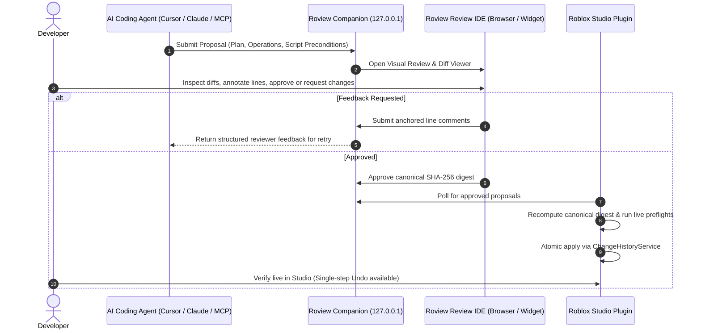

<div align="center">

# Roview

**Visual review, interactive diff annotations, and fail-closed safety preflights for AI-assisted Roblox Studio development.**

[](LICENSE)
[](https://nodejs.org)
[](https://www.roblox.com/create)
[](https://github.com/Mackaye/roview/actions/workflows/ci.yml)
[](#privacy--security-boundary)

<p align="center">
  <a href="#quickstart">Quickstart</a> •
  <a href="#features">Features</a> •
  <a href="#how-it-works">How It Works</a> •
  <a href="#mcp-client-setup">MCP Client Setup</a> •
  <a href="#safety-model">Safety Model</a> •
  <a href="#cli-reference">CLI Reference</a> •
  <a href="#contributing">Contributing</a>
</p>

---

</div>

## Overview

AI coding agents are fast, but unreviewed mutations in Roblox Studio can silently break DataModel hierarchies, overwrite script edits, or corrupt place properties.

**Roview** bridges the gap between AI coding assistants and Roblox Studio. Instead of allowing agents to blindly mutate your open Studio session, Roview captures proposed changes as **typed, cryptographic proposals**. You inspect the architectural plan, visual Luau diffs, and Explorer operations in a local browser review IDE or Studio widget, annotate changes with point-and-click feedback, and approve the exact digest before Roblox Studio performs an atomic, undoable apply.

---

## Features

| Feature | Description |
| :--- | :--- |
| 🔍 **Visual Code & Instance Diffs** | Side-by-side split and unified syntax-highlighted Luau diffs alongside visual instance operations (create, set property, reparent, delete). |
| 💬 **Interactive Line Annotations** | Click any diff line or Explorer operation to leave inline comments and send structured feedback directly back into the calling agent prompt. |
| 🛡️ **Fail-Closed Safety Engine** | Enforces SHA-256 script hashing, duplicate-name collision protection, and top-level service deletion blocks before touching the DataModel. |
| ⚡ **Atomic Single-Undo Apply** | Executes approved proposals inside Studio under one `ChangeHistoryService` recording with instant `Ctrl+Z` / `Cmd+Z` full rollback. |
| 🔌 **Universal MCP Drop-in** | Works out-of-the-box with **Cursor**, **Claude Desktop**, **Windsurf**, **VS Code** (Cline / Roo Code), and **Codex**. |
| 🔀 **Companion & Safe Modes** | Run alongside the official Roblox Studio MCP (Companion Mode) or use Roview as a sandboxing proxy to block untrusted mutations (Safe Mode). |
| 🔒 **100% Local & Private** | Binds strictly to `127.0.0.1` with high-entropy token authentication. Zero telemetry, zero external tracking, zero cloud dependencies. |

---

## How It Works



### Proposal Lifecycle States

```text
READY_FOR_REVIEW ──► APPROVED ──► PREFLIGHT ──► APPLYING ──► APPLIED
       │                                              │
       ├──► CHANGES_REQUESTED                         └──► APPLY_FAILED
       ├──► REJECTED
       └──► CANCELLED
```

---

## Quickstart

### Prerequisites

- **Node.js 22+** and **pnpm**
- **Roblox Studio** with HTTP requests enabled in *Game Settings → Security → Allow HTTP Requests*
- **Roview Studio Plugin** (`roview-plugin.rbxm` from [Releases](https://github.com/Mackaye/roview/releases) or built from source)

### 1. Install & Start Companion

Clone the repository and start the companion server with the included interactive demo fixture:

```sh
git clone https://github.com/Mackaye/roview.git
cd roview
pnpm install
pnpm build:plugin   # Compiles roview-plugin.rbxm
pnpm demo           # Starts companion with preloaded demo proposal
```

### 2. Install Studio Plugin

1. Copy `roview-plugin.rbxm` into your Roblox Studio plugins directory:
   - **macOS**: `~/Documents/Roblox/Plugins`
   - **Windows**: `%LOCALAPPDATA%\Roblox\Plugins`
2. Open Roblox Studio and open the **Roview** widget.
3. Enter the one-time pairing token printed in your companion terminal to link Studio securely.

### 3. Review & Apply

1. Open `http://127.0.0.1:3219` to view the demo proposal in your browser.
2. Toggle between **Split** and **Unified** diffs, test adding line comments, and click **Approve**.
3. In Roblox Studio, click **Apply changes** to execute the proposal atomically.
4. Press `Ctrl+Z` (or `Cmd+Z`) in Studio to test single-action rollback!

---

## MCP Client Setup

Roview provides an interactive automated setup wizard to configure your preferred AI coding client:

```sh
pnpm setup:mcp -- --client cursor --mode companion
```

### Manual Configuration

#### Cursor (`.cursor/mcp.json`)

```json
{
  "mcpServers": {
    "roview": {
      "command": "node",
      "args": ["/path/to/roview/apps/mcp/dist/index.js"],
      "env": {
        "ROVIEW_TOKEN": "your-session-token",
        "ROVIEW_URL": "http://127.0.0.1:3219"
      }
    }
  }
}
```

#### Claude Desktop (`claude_desktop_config.json`)

```json
{
  "mcpServers": {
    "roview": {
      "command": "node",
      "args": ["/path/to/roview/apps/mcp/dist/index.js"],
      "env": {
        "ROVIEW_TOKEN": "your-session-token",
        "ROVIEW_URL": "http://127.0.0.1:3219"
      }
    }
  }
}
```

#### Windsurf (`~/.codeium/windsurf/mcp_config.json`)

```json
{
  "mcpServers": {
    "roview": {
      "command": "node",
      "args": ["/path/to/roview/apps/mcp/dist/index.js"],
      "env": {
        "ROVIEW_TOKEN": "your-session-token",
        "ROVIEW_URL": "http://127.0.0.1:3219"
      }
    }
  }
}
```

---

## Safety Model

Roview enforces strict fail-closed boundaries:

| Operation Kind | Scope / Policy | Safety Verification |
| :--- | :--- | :--- |
| `replaceScriptSource` | Luau Scripts (`Script`, `LocalScript`, `ModuleScript`) | Compares editor SHA-256 against reviewed hash; rejects if modified in Studio. |
| `createInstance` | Narrow Class Allow-list (`Part`, `Folder`, `RemoteEvent`, etc.) | Validates parent existence and enforces `nameCollision: "fail"` / `"replace"`. |
| `setProperty` | Strongly typed property primitives & tagged values | Preflight verifies current property value and types before mutation. |
| `reparentInstance` | Instance relocation in DataModel | Prevents reparenting into descendants or moving top-level game services. |
| `deleteInstance` | Instance destruction | Blocks deletion of top-level services (`Workspace`, `ReplicatedStorage`, etc.). |

---

## CLI Reference

The `roview` CLI provides full control over local proposal management and diagnostics:

```sh
# Submit a proposal file manually
ROVIEW_TOKEN='<token>' pnpm cli submit packages/fixtures/proposals/daily-reward.json

# List active and historical proposals
pnpm cli list

# Inspect proposal status and feedback
pnpm cli status <proposal-id> <revision>

# Cancel a pending proposal
pnpm cli cancel <proposal-id> <revision>

# Run system and companion diagnostics
pnpm cli doctor

# Purge expired/terminal proposal records
pnpm cli data-delete --yes
```

---

## Environment Variables

| Variable | Default | Description |
| :--- | :--- | :--- |
| `ROVIEW_PORT` | `3219` | Loopback port for companion server. |
| `ROVIEW_TOKEN` | *Generated* | High-entropy bearer token for authenticated requests. |
| `ROVIEW_DATA_PATH` | `.roview/proposals.json` | Path to persistent proposal JSON storage. |
| `ROVIEW_RETENTION_DAYS` | `30` | Number of days to retain terminal proposal records. |
| `STUDIO_MCP_COMMAND` | `roblox-studio-mcp` | Studio MCP binary to proxy when running in Safe Mode. |

---

## Repository Architecture

```
roview/
├── apps/
│   ├── companion/        # Fastify loopback server, local store & modern review webview IDE
│   ├── mcp/              # Local stdio MCP server (Companion Mode + Safe Mode Studio proxy)
│   ├── setup/            # Setup wizard & agent policy pack generator (.cursorrules, CLAUDE.md)
│   ├── cli/              # CLI utility tools (submit, status, list, doctor, data-delete)
│   └── studio-plugin/    # Roblox Studio plugin (fail-closed preflight + ChangeHistoryService apply)
├── packages/
│   ├── protocol/         # Zero-dependency protocol schemas, SHA-256 digest & validation
│   └── fixtures/         # Standard test fixtures (stale drift, ambiguous locators, etc.)
├── docs/                 # Architectural specifications, MCP adoption guide & protocol specs
└── examples/demo-place/  # Roblox Studio demo place fixture
```

---

## Contributing

We welcome contributions! See [CONTRIBUTING.md](CONTRIBUTING.md) for local development instructions, Luau linting and formatting guidelines, and test harness execution.

```sh
# Run type checks and test suites
pnpm build
pnpm test

# Luau plugin checks (requires Selene, StyLua, Rojo)
pnpm check:luau
pnpm format:luau
pnpm build:plugin
```

---

## Privacy & Security Boundary

- **Zero Cloud & Telemetry**: Roview never sends your codebase, plans, or tokens to any external server.
- **Fail-Closed by Design**: Mismatched digests, unexpected mutations, or missing preconditions immediately halt apply.
- Read our full [Security Policy](SECURITY.md) for vulnerability reporting.

---

## License

Licensed under the [Apache License 2.0](LICENSE).

*Roview is an independent open-source project and is not affiliated with or endorsed by Roblox Corporation.*
